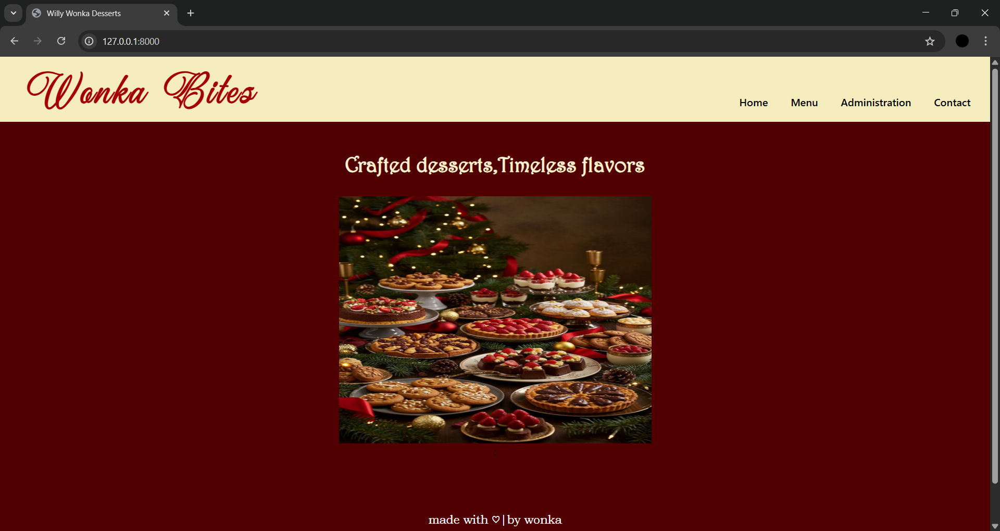
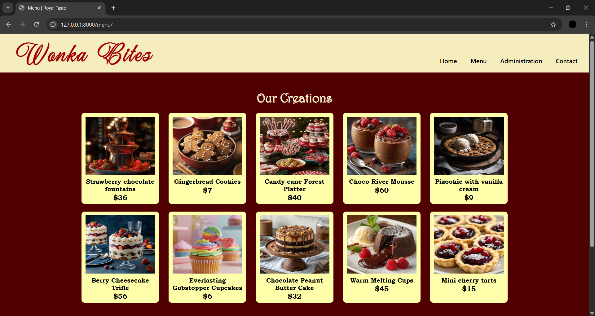
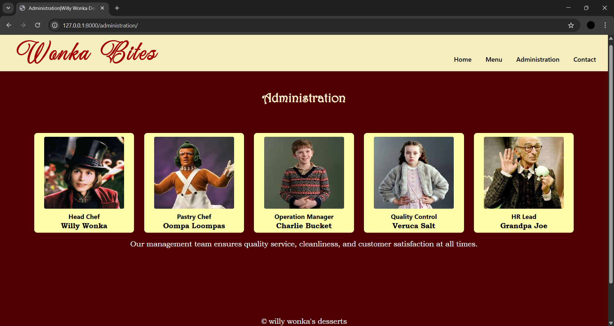
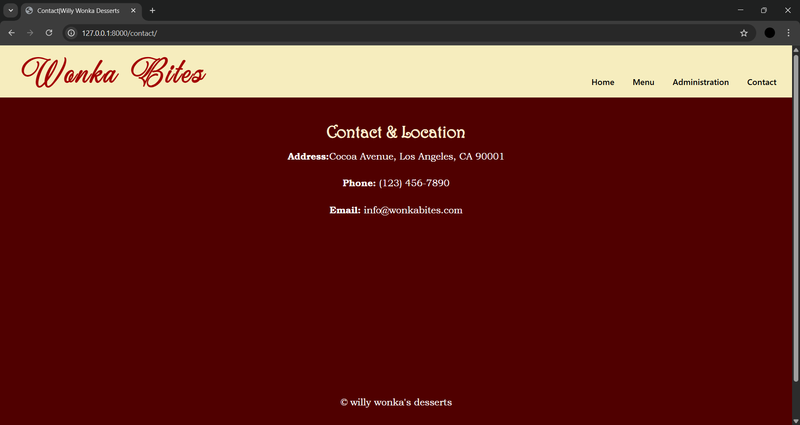

# Ex.07 Restaurant Website
# Date:
# AIM:
To develop a static Restaurant website to display the food items and services provided by them.

# DESIGN STEPS:
## Step 1:
Requirement collection.

## Step 2:
Creating the layout using HTML and CSS.

## Step 3:
Updating the sample content.

## Step 4:
Choose the appropriate style and color scheme.

## Step 5:
Validate the layout in various browsers.

## Step 6:
Validate the HTML code.

## Step 7:
Publish the website in the given URL.

# PROGRAM:
home.html
```
 
 <html>
    <head>
        <title>Willy Wonka Desserts</title>
        <link rel="stylesheet" href="">
    </head>
    <body>
        <nav>
            <h1>Wonka Bites</h1>
            <div>
            <a href="">Home</a>
            <a href="">Menu</a>
            <a href="">Administration</a>
            <a href="">Contact</a>
            </div>
        </nav>
        <div class="container">
            <h2>Crafted desserts,Timeless flavors</h2>
            ;
        </div>
        <footer class="home-footer">
            <p>made with ♡|by wonka</p>
        </footer>
    </body>
    </html>
 ```
menu.html
```

<html>
<head>
    <title>Menu | Royal Taste</title>
    <link rel="stylesheet" href="">
</head>
<body>
    <nav>
        <h1>Wonka Bites</h1>
        <div>
        <a href="">Home</a>
        <a href="">Menu</a>
        <a href="">Administration</a>
        <a href="">Contact</a>
        </div>
    </nav>
    
    <div class="container">
    <h2>Our Creations</h2>
</div>
<div class="menu-grid">
    <div class="menu-item"><h5>Strawberry chocolate fountains</h5><p>$36</p></div>
    <div class="menu-item"><h5>Gingerbread Cookies</h5><p>$7</p></div>
    <div class="menu-item"><h5>Candy cane Forest Platter</h5><p>$40</p></div>
    <div class="menu-item"><h5>Choco River Mousse</h5><p>$60</p></div>
    <div class="menu-item"><h5>Pizookie with vanilla cream</h5><p>$9</p></div>
    <div class="menu-item"><h5>Berry Cheesecake Trifle</h5><p>$56</p></div>
    <div class="menu-item"><h5>Everlasting Gobstopper Cupcakes</h5><p>$6</p></div>
    <div class="menu-item"><h5>Chocolate Peanut Butter Cake</h5><p>$32</p></div>
    <div class="menu-item"><h5>Warm Melting Cups</h5><p>$45</p></div>
    <div class="menu-item"><h5>Mini cherry tarts</h5><p>$15</p></div>     
</div>

<footer>
    <p>© willy wonka's desserts</p>
</footer>
</body>
</html>

```
administration.html
```

<html>
<head>
    <title>Administration|Willy Wonka Desserts </title>
    <link rel="stylesheet" href="">
</head>
<body>
    <nav>
        <h1>Wonka Bites</h1>
        <div>
        <a href="">Home</a>
        <a href="">Menu</a>
        <a href="">Administration</a>
        <a href="">Contact</a>
        </div>
    </nav>
<div class="container">
    <h2>Administration</h2>
    <div class="admin-grid">
    <div class="admin-1"><h5>Head Chef</h5><p>Willy Wonka</p></div>
    <div class="admin-2"><h5>Pastry Chef</h5><p>Oompa Loompas</p></div>
    <div class="admin-3"><h5>Operation Manager</h5><p>Charlie Bucket </p></div>
    <div class="admin-4"><h5>Quality Control</h5><p>Veruca Salt</p></div>
    <div class="admin-5"><h5>HR Lead</h5><p>Grandpa Joe</p></div>
</div>
<p>Our management team ensures quality service, cleanliness,
        and customer satisfaction at all times.
    </p>
</div>

<footer>
    <p>© willy wonka's desserts</p>
</footer>
</body>
</html>
```
contact.html
```
<html>
<head>
    <title>Contact|Willy Wonka Desserts</title>
    <link rel="stylesheet" href="">
</head>
<body>
    <nav>
        <h1>Wonka Bites</h1>
        <div>
        <a href="">Home</a>
        <a href="">Menu</a>
        <a href="">Administration</a>
        <a href="">Contact</a>
    </div>
    </nav>
<div class="container">
    <h2>Contact & Location</h2>
    <p><strong>Address:</strong>Cocoa Avenue, Los Angeles, CA 90001</p>
    <p><strong>Phone:</strong> (123) 456-7890</p>
    <p><strong>Email:</strong> info@wonkabites.com</p>
</div>

<footer class="contact-footer">
    <p>© willy wonka's desserts</p>
</footer>
</body>
</html>
```
CSS.css
```
@font-face {
    font-family: 'WonkaFont';
    src: url('delight.ttf');
}
body {
    margin: 0;
    padding: 0;
    background-color: #500000;   
    font-family: 'Segoe UI';
    color: #000;
}
.home-img {
    display: block;          
    margin: 30px auto 0;     
}
nav {
    background-color: #f6edbe;  
    padding: 0px 30px;
    display: flex;
    justify-content: space-between; 
    align-items: center;
    height: 100px;
    align-items: flex-start;
    position: relative;
}
nav h1 {
    font-size: 48px;
    font-family: 'WonkaFont';
    font-weight:900;
    letter-spacing: 3px;
    color: rgb(162, 0, 0);
    margin: 0;
    position: absolute;
    top: 10px;
    left: 40px;

}
nav a {
    margin-left: 25px;
    text-decoration: none;
    color: #000000;          
    font-size: 16px;
    font-weight: 500;
}
nav div {
    display: flex;
    gap: 10px 10px;
    position: absolute;
    align-items: center;
    bottom: 20px;
    right: 30px;
}

nav a:hover {
    text-decoration: underline;
}

.container {
    text-align: center;
    padding: 20px 20px;
}
h2{
    color: #fff2d2;
    font-family: Harrington;
    font-size: 32px;
    margin-bottom: 0;
}
p {
    margin-bottom: 30px;
    font-size: 18px;
    color: #ffffff;
    font-family: Bookman Old Style;
}

.menu-grid {
    display: grid;
    grid-template-columns: 200px 200px 200px 200px 200px;
    gap: 20px 25px;
    justify-content: center;
   
}
.menu-item {
    background-color: #fffeaa;
    padding: 10px;
    text-align: center;
    border-radius: 8px;
    height: 215px;
}

.menu-item img {
    margin-bottom: 4px;
    width: 180px;
    height: 150px;
}
.menu-item h5 {
    font-size: 16px;
    font-family:Bookman Old Style;
    margin: 4px 0 2px;
    justify-content: center;
}
.menu-item p {
    margin-top: 2px;
    font-weight: bold;
    color: #000;
}
.admin-grid {
    display: grid;
    grid-template-columns: 250px 250px 250px 250px 250px;
    gap: 20px 25px;
    justify-content: center;
    margin-top: 70px;
}

.admin-grid  div{
    background-color: #fffeaa;
    padding: 10px;
    text-align: center;
    border-radius: 8px;
    height: 230px;
}
.admin-grid img {
    width: 200px;
    height: 180px;
    margin-bottom: 4px;
    border-radius: 4px;
}
.admin-grid h5 {
    font-size: 16px;
    margin: 4px 0 2px;
}

.admin-grid p {
    margin-top: 2px;
    font-weight: bold;
    color: #000;
}
.home-footer {
    margin-top: 5px;  
    padding: 40px;
    text-align: center;
    color: #000000;   
    font-size: 14px;
}
footer {
    margin-top: 25px;
    padding: 80px;
    text-align: center;
    color: #000000;   
    font-size: 14px;
}
.contact-footer {
    margin-top: 200px;  
    padding: 80px;
    text-align: center;
    color: #000000;   
    font-size: 14px;
}
```
urls.py 
```
from django.urls import path
from willywonka import views

urlpatterns = [
    path('', views.home, name='home'),
    path('menu/', views.menu, name='menu'),
    path('contact/', views.contact, name='contact'),
    path('administration/', views.admin_page, name='administration'),
]

```
views.py
```
from django.shortcuts import render

def home(request):
    return render(request, 'home.html')

def menu(request):
    return render(request, 'menu.html')

def admin_page(request):
    return render(request, 'administration.html')

def contact(request):
    return render(request, 'contact.html')
```
# OUTPUT:





# RESULT:
The program for designing software company website using HTML and CSS is completed successfully.
